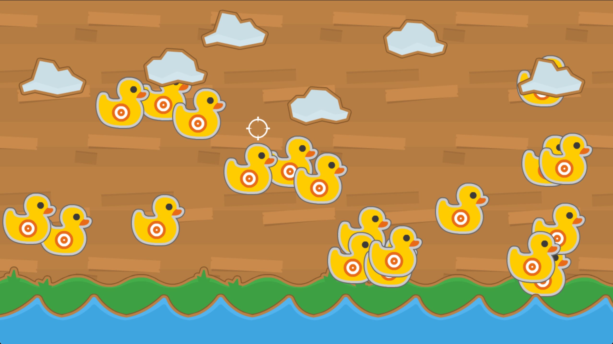

# Shooting Range

This a simple duck shooting range game I built in Python whilst taking the [An introduction to game development in Python](https://www.udemy.com/course/an-introduction-to-game-development-in-python/) course.

## Screenshot
<p align="center">

</p>

## Dependencies 

* python3
* pygame
* sys
* random

## Assets 
The assets for this game are open source from 
https://opengameart.org/content/shooting-gallery

## How To Run 

### 1. Ensure the above dependencies are installed

### 2. Clone The Project:
```
git clone git@github.com:Steven-Klavins/shooting-range.git
```
### 3. Navigate to projects root direcotry and run:
```
python3 shooting-range.py
```
